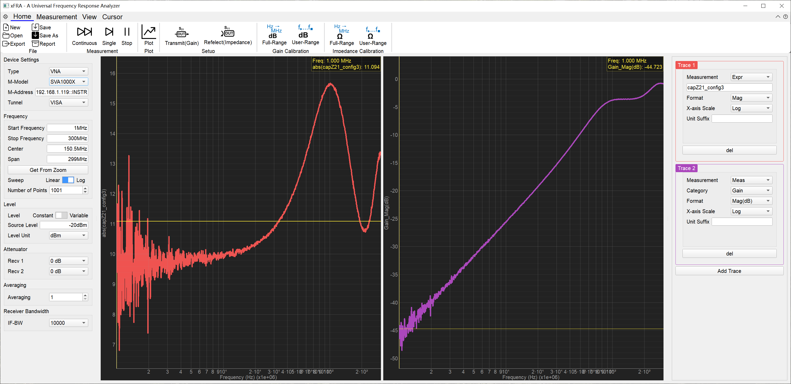

**其他语言: [中文](README.md), [English](README_en.md).**
# xFRA: A Python-based Universal Frequency Response Analyzer Software

xFRA is a universal FRA software, the GUI is based on PyQt.
xFRA的设计理念基于通用化虚拟仪器，包括GUI、数据转换、以及仪器通讯。
## GUI (xFRA)
GUI（xFRA）基于PyQt编写。
## 数据转换（xConv）
数据转换层（xConv）包含两部分，分别为S2P解析器（xSNP_Interaptor）和公式解析器（xFormula），其能够读入以S2P格式存储的文件，并转换为诸多格式。转换的功能基于公式解析器，其能够直接解析以文本形式编辑的公式，并提供对应的复数转换功能。
## 仪器通讯层（xDriver）
仪器通讯层（xDriver）为将设备测量的各种信号转换为S2P文件，提供一个通用化的转换层。在这里提供了基本类，第一种为VNA类，这一类仪器的定义是能够直接输出S2P的仪器，在提供基本的测试需求之后就可以直接返回描述网络的S2P文件。另外一种则是EM类（Excitation-Measurement类），这种类定义更为广泛，包括激励和测量仪器，可以任意组合激励和测量。基于这种理念设计的EM类，可以实现例如使用电脑声卡做激励源但用示波器测量频响等操作。
## To Do List
### xFRA
- [x] GUI界面完全参考
- [X] GUI导入数据绘制
- [X] GUI提供数据游标
- [ ] 设定迹线的数据来源:half finishied
- [ ] 自定义选择合在哪个窗口当中需要修改：
        1. WaveWidget的多波形函数
        2. GUI上如何选择放入哪个窗口？
        3. 重构Trace的顺序产生，要求优先从数字较小的一端开始添加。
### xConv
- [X] 读取并解析S2P文件
- [X] 对任意公式进行解析
- [X] 提供基本数学函数
### xDriver
- [X] 梳理基本输入输出格式
    - [x] VNA Class
    - [ ] E-M Class 
- [ ] Driver for NanoVNA
- [X] Driver for LibreVNA
- [X] Driver for SVA1000X
- [ ] Driver for OSC+AFG
## Bug List
- [X] SVA1000X驱动在每次改变测试设置的时候第一次数据输出会卡一次，采集到的数据为全0
## update log
2025年12月3日：里程碑，完成了大多数的xConv功能和GUI功能的开发，开始进行xDriver的开发
2025年12月6日：里程碑，完成了GUI基本功能的开发，可以自动测量并刷新，完成了SVA1000X和LibreVNA的驱动开发。